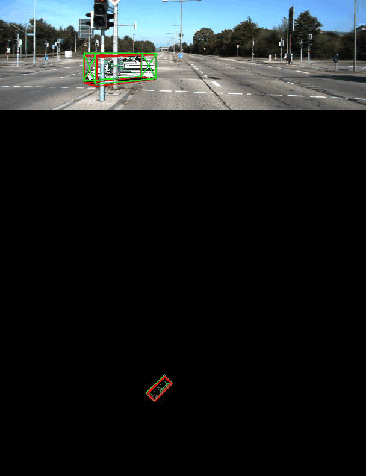

# KITTI_Visualize

GitHub Link:[A convenient tool to visualize KITTI dataset.](https://github.com/SekiroRong/KITTI_Visualize)

## Feature

- [x] Support Visualize prediction generate by MMDet3D (.obj format)

- [x] Support project pointcloud to BEV map

- [x] Support project pointcloud to Camera View

## Result



## Requirement

```
pip install  requirements.txt
```

## Get Start

```
python Dataset/kittidataset.py
```

## Contact

If you think this work is useful, please give me a star!  
If you find any errors or have any suggestions, please contact me (**Email:** `sekirorong@gmail.com`).  
Thank you!